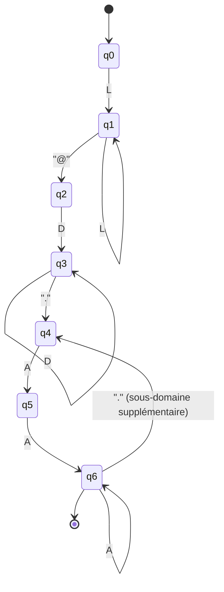
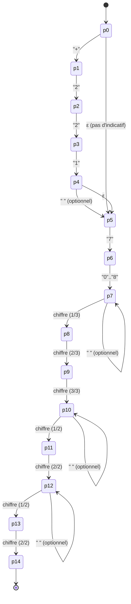
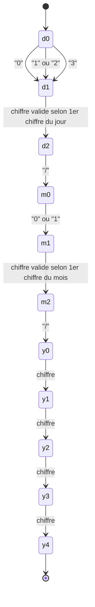

# Partie 3 : Automates finis

## 6-7. Automates de reconnaissance : états, transitions, états finaux

Les trois automates ci-dessous formalisent les expressions régulières EMAIL, PHONE et DATE définies en Partie 2. Chaque section fournit :
- un diagramme d'états (format [Mermaid](https://mermaid.js.org/), qui se rend directement dans GitHub / VS Code / la plupart des lecteurs Markdown) ;
- un tableau de transition détaillé ;
- la liste des états finaux (acceptants).

> Les diagrammes sont fournis en source Mermaid ci-dessous (rendus directement dans ce fichier) et exportés en image dans `docs/images/automate_email.png`, `docs/images/automate_telephone.png` et `docs/images/automate_date.png` (générés avec `@mermaid-js/mermaid-cli`).

---

## Automate EMAIL

**Alphabet simplifié** : `L` = lettre/chiffre/`.`/`_`/`%`/`+`/`-` (caractère de partie locale), `D` = lettre/chiffre/`-` (caractère de domaine), `A` = lettre (caractère d'extension).

### Diagramme

### Tableau de transition

| État | Sur entrée | État suivant | Type |
|---|---|---|---|
| `q0` (initial) | `L` (car. partie locale) | `q1` | — |
| `q1` | `L` | `q1` (boucle) | — |
| `q1` | `@` | `q2` | — |
| `q2` | `D` (car. domaine) | `q3` | — |
| `q3` | `D` | `q3` (boucle) | — |
| `q3` | `.` | `q4` | — |
| `q4` | `A` (lettre) | `q5` | — |
| `q5` | `A` | `q6` | **final** |
| `q6` | `A` | `q6` (boucle) | **final** |
| `q6` | `.` | `q4` (sous-domaine supplémentaire) | — |

**États finaux** : `{q6}` — atteint après au moins 2 lettres consécutives suivant le dernier `.` (garantit une extension d'au moins 2 caractères, ex. `.sn`, `.com`).

**Exemple de trace** sur `amadou.diallo@gmail.com` :
`q0 →(a,m,a,d,o,u,.,d,i,a,l,l,o) q1 →(@) q2 →(g) q3 →(m,a,i,l) q3 →(.) q4 →(c) q5 →(o) q6 →(m) q6` **accepté**.

---

## Automate PHONE

Format cible : `(+221 )?7[0-8] DDD DD DD` avec espaces optionnels entre les groupes.

### Diagramme

### Tableau de transition

| État | Sur entrée | État suivant | Type |
|---|---|---|---|
| `p0` (initial) | `+` | `p1` | — |
| `p0` | `7` (pas d'indicatif) | `p6` | — |
| `p1` | `2` | `p2` | — |
| `p2` | `2` | `p3` | — |
| `p3` | `1` | `p4` | — |
| `p4` | ` ` (optionnel) / `7` | `p5` / `p6` | — |
| `p5` | `7` | `p6` | — |
| `p6` | `0`-`8` | `p7` | — |
| `p7` | ` ` (optionnel) puis chiffre | `p7` / `p8` | — |
| `p8` | chiffre | `p9` | — |
| `p9` | chiffre | `p10` | — |
| `p10` | ` ` (optionnel) puis chiffre | `p10` / `p11` | — |
| `p11` | chiffre | `p12` | — |
| `p12` | ` ` (optionnel) puis chiffre | `p12` / `p13` | — |
| `p13` | chiffre | `p14` | **final** |

**États finaux** : `{p14}` — atteint après les 9 chiffres du numéro (indicatif `+221` optionnel non compté), quelle que soit la présence des espaces optionnels entre les groupes.

**Exemple de trace** sur `77 123 45 67` :
`p0 →(7) p6 →(7) p7 →( ) p7 →(1) p8 →(2) p9 →(3) p10 →( ) p10 →(4) p11 →(5) p12 →( ) p12 →(6) p13 →(7) p14` **accepté**.

---

## Automate DATE

Format cible : `JJ/MM/AAAA` avec `JJ ∈ [01,31]`, `MM ∈ [01,12]`.

### Diagramme

### Tableau de transition

| État | Sur entrée | État suivant | Type |
|---|---|---|---|
| `d0` (initial) | `0` | `d1` | — |
| `d0` | `1` ou `2` | `d1` | — |
| `d0` | `3` | `d1` | — |
| `d1` | `1`-`9` (si `d0` était `0`) | `d2` | — |
| `d1` | `0`-`9` (si `d0` était `1` ou `2`) | `d2` | — |
| `d1` | `0` ou `1` (si `d0` était `3`) | `d2` | — |
| `d2` | `/` | `m0` | — |
| `m0` | `0` | `m1` | — |
| `m0` | `1` | `m1` | — |
| `m1` | `1`-`9` (si `m0` était `0`) | `m2` | — |
| `m1` | `0`-`2` (si `m0` était `1`) | `m2` | — |
| `m2` | `/` | `y0` | — |
| `y0` | chiffre | `y1` | — |
| `y1` | chiffre | `y2` | — |
| `y2` | chiffre | `y3` | — |
| `y3` | chiffre | `y4` | **final** |

**États finaux** : `{y4}` — atteint après 4 chiffres d'année, à condition que le jour et le mois aient respecté les bornes ci-dessus.

**Exemple de trace** sur `15/06/2026` :
`d0 →(1) d1 →(5) d2 →(/) m0 →(0) m1 →(6) m2 →(/) y0 →(2) y1 →(0) y2 →(2) y3 →(6) y4` **accepté**.

**Limite assumée** (cf. Partie 1, difficulté n°4 et Partie 10) : cet automate valide la forme syntaxique de la date (bornes `01`-`31` pour le jour, `01`-`12` pour le mois) mais ne valide pas la cohérence calendaire complète (ex. `31/04/2026` est syntaxiquement accepté bien qu'avril n'ait que 30 jours, et les années bissextiles ne sont pas prises en compte pour `29/02`). Une validation calendaire complète nécessiterait une logique dépendante du mois, hors de portée d'un automate fini simple.
